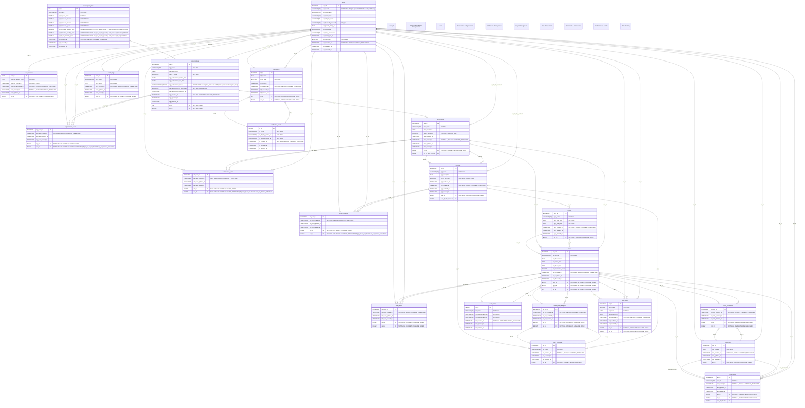

```mermaid
erDiagram
    users {
        BIGSERIAL usr_id PK

        VARCHAR(255) usr_email "NOT NULL, UNIQUE (partial: WHERE deleted_at IS NULL)"
        VARCHAR(100) usr_first_name
        VARCHAR(100) usr_last_name
        VARCHAR(55) usr_display_name
        VARCHAR(255) usr_hashed_password "BCrypt"
        TEXT usr_profile_image_url
        VARCHAR(55) usr_timezone
        VARCHAR(55) usr_lang_preference
        TIMESTAMP usr_last_login_at
        BOOLEAN usr_is_active "NOT NULL"

        TIMESTAMP usr_created_at "NOT NULL, DEFAULT CURRENT_TIMESTAMP"
        TIMESTAMP usr_updated_at
        TIMESTAMP usr_deleted_at
    }
    
    user_sessions {
        UUID ssn_id PK

        TEXT ssn_jwt_refresh_token "NOT NULL"
        TIMESTAMP ssn_will_expire_at "NOT NULL, INDEX"
        TIMESTAMP ssn_last_accessed_at "NOT NULL, DEFAULT CURRENT TIMESTAMP"

        TIMESTAMP ssn_created_at "NOT NULL, DEFAULT CURRENT_TIMESTAMP"
        TIMESTAMP ssn_updated_at

        BIGINT usr_id FK "NOT NULL, ON DELETE CASCADE, INDEX"
    }
    
    subscription_plans {
        INT spl_id PK

        VARCHAR(55) spl_name "NOT NULL"
        DECIMAL spl_regular_price "NOT NULL"
        DECIMAL spl_discount_3months "DEFAULT 0.00"
        DECIMAL spl_discount_6months "DEFAULT 0.00"
        DECIMAL spl_discount_1year "DEFAULT 0.00"
        DECIMAL spl_3months_monthly_price "GENERATED ALWAYS AS (spl_regular_price * (1 - spl_discount_3months)) STORED"
        DECIMAL spl_6months_monthly_price "GENERATED ALWAYS AS (spl_regular_price * (1 - spl_discount_6months)) STORED"
        DECIMAL spl_1year_monthly_price "GENERATED ALWAYS AS (spl_regular_price * (1 - spl_discount_1year)) STORED"

        TIMESTAMP spl_created_at "NOT NULL, DEFAULT CURRENT_TIMESTAMP"
        TIMESTAMP spl_updated_at
        TIMESTAMP spl_deleted_at
    }

    organizations {
        BIGSERIAL org_id PK

        VARCHAR(255) org_name "NOT NULL"
        TEXT org_description
        BOOLEAN org_is_active "NOT NULL"
        DATE org_subscription_started_date
        DATE org_subscription_end_date
        SUBSCRIPTION_STATUS org_subscription_status "CREATE TYPE subscription_status AS ENUM('active', 'canceled', 'expired', 'trial')"
        BOOLEAN org_subscription_is_autorenew "NOT NULL, DEFAULT true"
        TIMESTAMP org_subscription_canceled_at

        TIMESTAMP org_created_at "NOT NULL, DEFAULT CURRENT_TIMESTAMP"
        TIMESTAMP org_updated_at
        TIMESTAMP org_deleted_at

        INT spl_id FK "NOT NULL, INDEX"
        BIGINT usr_id FK "NOT NULL, INDEX"
    }

    organizations_users {
        BIGSERIAL org_usr_id PK

        TIMESTAMP org_usr_created_at "NOT NULL, DEFAULT CURRENT_TIMESTAMP"
        TIMESTAMP org_usr_updated_at
        TIMESTAMP org_usr_deleted_at

        BIGINT org_id FK "NOT NULL, ON DELETE CASCADE, INDEX"
        BIGINT usr_id FK "NOT NULL, ON DELETE CASCADE, INDEX, UNIQUE(org_id, usr_id) WHERE org_usr_deleted_at IS NULL"
    }

    workspaces {
        BIGSERIAL wks_id PK

        VARCHAR(255) wks_name "NOT NULL"
        TEXT wks_description
        BOOLEAN wks_is_archived "NOT NULL, DEFAULT false"
        TIMESTAMP wks_archived_at
        
        TIMESTAMP wks_created_at "NOT NULL, DEFAULT CURRENT_TIMESTAMP"
        TIMESTAMP wks_updated_at
        TIMESTAMP wks_deleted_at

        BIGINT org_id FK "NOT NULL, ON DELETE CASCADE, INDEX"
        BIGINT usr_id_who_archived FK

    }

    workspaces_users{
        BIGSERIAL wks_usr_id PK
        
        TIMESTAMP wks_usr_created_at "NOT NULL, DEFAULT CURRENT_TIMESTAMP"
        TIMESTAMP wks_usr_updated_at
        TIMESTAMP wks_usr_deleted_at

        BIGINT wks_id FK "NOT NULL, ON DELETE CASCADE, INDEX"
        BIGINT usr_id FK "NOT NULL, ON DELETE CASCADE, INDEX, UNIQUE(wks_id, usr_id) WHERE wks_usr_deleted_at IS NULL"
    }

    projects {
        BIGSERIAL prj_id PK

        VARCHAR(255) prj_name "NOT NULL"
        TEXT prj_description
        BOOLEAN prj_is_archived "NOT NULL, DEFAULT false"
        TIMESTAMP prj_archived_at
        
        TIMESTAMP prj_created_at "NOT NULL, DEFAULT CURRENT_TIMESTAMP"
        TIMESTAMP prj_updated_at
        TIMESTAMP prj_deleted_at

        BIGINT wks_id FK "NOT NULL, ON DELETE CASCADE, INDEX"
        BIGINT usr_id_who_archived FK
    }

    projects_users{
        BIGSERIAL prj_usr_id PK
        
        TIMESTAMP prj_usr_created_at "NOT NULL, DEFAULT CURRENT_TIMESTAMP"
        TIMESTAMP prj_usr_updated_at
        TIMESTAMP prj_usr_deleted_at

        BIGINT prj_id FK "NOT NULL, ON DELETE CASCADE, INDEX"
        BIGINT usr_id FK "NOT NULL, ON DELETE CASCADE, INDEX, UNIQUE(prj_id, usr_id) WHERE prj_usr_deleted_at IS NULL"
    }

    tasks{
        BIGSERIAL tsk_id PK

        VARCHAR(255) tsk_name "NOT NULL"
        TEXT tsk_description
        DATE tsk_start_date
        DATE tsk_due_date
        DECIMAL tsk_estimated_hours

        TIMESTAMP tsk_created_at "NOT NULL, DEFAULT CURRENT_TIMESTAMP"
        TIMESTAMP tsk_updated_at
        TIMESTAMP tsk_deleted_at

        BIGINT wks_id FK "NOT NULL, ON DELETE CASCADE, INDEX"
        BIGINT spr_id FK "NOT NULL, ON DELETE CASCADE, INDEX"
        INT tst_id FK "NOT NULL, ON DELETE CASCADE, INDEX"
    }

    tasks_users{
        BIGSERIAL tsk_usr_id PK

        TIMESTAMP tsk_usr_created_at "NOT NULL, DEFAULT CURRENT_TIMESTAMP"
        TIMESTAMP tsk_usr_updated_at
        TIMESTAMP tsk_usr_deleted_at

        BIGINT tsk_id FK "NOT NULL, ON DELETE CASCADE, INDEX"
        BIGINT usr_id FK "NOT NULL, ON DELETE CASCADE, INDEX"
    }

    task_categories{
        BIGSERIAL tsc_id PK

        VARCHAR(255) tsc_name "NOT NULL"

        TIMESTAMP tsc_created_at "NOT NULL, DEFAULT CURRENT_TIMESTAMP"
        TIMESTAMP tsc_updated_at
        TIMESTAMP tsc_deleted_at 

        BIGINT prj_id FK "NOT NULL, ON DELETE CASCADE, INDEX"
    }

    tasks_task_categories {
        BIGSERIAL tsk_tsc_id PK
        
        TIMESTAMP tsk_tsc_created_at "NOT NULL, DEFAULT CURRENT_TIMESTAMP"
        TIMESTAMP tsk_tsc_updated_at
        TIMESTAMP tsk_tsc_deleted_at 

        BIGINT tsk_id FK "NOT NULL, ON DELETE CASCADE, INDEX"
        BIGINT tsc_id FK "NOT NULL, ON DELETE CASCADE, INDEX"
    }

    task_status{
        SERIAL tst_id PK

        VARCHAR(55) tst_name "NOT NULL"
        VARCHAR(55) tst_display_name_en "NOT NULL"
        VARCHAR(55) tst_display_name_ja "NOT NULL"

        TIMESTAMP tst_created_at "NOT NULL, DEFAULT CURRENT_TIMESTAMP"
        TIMESTAMP tst_updated_at
        TIMESTAMP tst_deleted_at
    }

    sprints{
        BIGSERIAL spr_id PK

        VARCHAR(255) spr_name "NOT NULL"
        DATE spr_start_date "NOT NULL"
        DATE spr_end_date "NOT NULL"

        TIMESTAMP spr_created_at "NOT NULL, DEFAULT CURRENT_TIMESTAMP"
        TIMESTAMP spr_updated_at
        TIMESTAMP spr_deleted_at
        
        BIGINT prj_id FK "NOT NULL, ON DELETE CASCADE, INDEX"
    }

    comments{
        BIGSERIAL cmt_id PK
        TEXT cmt_content "NOT NULL"

        TIMESTAMP cmt_created_at "NOT NULL, DEFAULT CURRENT_TIMESTAMP"
        TIMESTAMP cmt_updated_at
        TIMESTAMP cmt_deleted_at

        BIGINT usr_id FK "NOT NULL, ON DELETE CASCADE, INDEX"
    }

    tasks_comments{
        BIGSERIAL tsk_cmt_id PK

        TIMESTAMP tsk_cmt_created_at "NOT NULL, DEFAULT CURRENT_TIMESTAMP"
        TIMESTAMP tsk_cmt_updated_at
        TIMESTAMP tsk_cmt_deleted_at

        BIGINT tsk_id FK "NOT NULL, ON DELETE CASCADE, INDEX"
        BIGINT cmt_id FK "NOT NULL, ON DELETE CASCADE, INDEX"
    }

    attachments{
        BIGSERIAL atc_id PK

        VARCHAR(255) atc_url "NOT NULL"

        TIMESTAMP atc_created_at "NOT NULL, DEFAULT CURRENT_TIMESTAMP"
        TIMESTAMP atc_updated_at
        TIMESTAMP atc_deleted_at

        BIGINT usr_id FK "NOT NULL, ON DELETE CASCADE, INDEX"
        BIGINT tsk_id FK "NOT NULL, ON DELETE CASCADE, INDEX" 
        BIGINT cmt_id_attached FK
    }

    notifications{
        BIGSERIAL ntf_id PK

        TEXT ntf_content
        BOOLEAN ntf_is_read "NOT NULL"
        TIMESTAMP ntf_read_at

        TIMESTAMP ntf_created_at "NOT NULL, DEFAULT CURRENT_TIMESTAMP"
        TIMESTAMP ntf_updated_at
        TIMESTAMP ntf_deleted_at

        INT ntl_id FK "NOT NULL, ON DELETE CASCADE, INDEX"
        BIGINT usr_id FK "NOT NULL, ON DELETE CASCADE, INDEX"
    }

    notification_levels {
        SERIAL ntl_id PK

        VARCHAR(55) ntl_name "NOT NULL"
        VARCHAR(55) ntl_display_name_en "NOT NULL"
        VARCHAR(55) ntl_display_name_ja "NOT NULL"

        TIMESTAMP ntl_created_at "NOT NULL, DEFAULT CURRENT_TIMESTAMP"
        TIMESTAMP ntl_updated_at
        TIMESTAMP ntl_deleted_at
    }

    activity_logs{
        BIGSERIAL act_id PK

        VARCHAR(255) act_action "NOT NULL"
        TEXT act_details "NOT NULL"

        TIMESTAMP act_created_at "NOT NULL, DEFAULT CURRENT_TIMESTAMP"
        TIMESTAMP act_updated_at
        TIMESTAMP act_deleted_at

        BIGINT usr_id FK "NOT NULL, ON DELETE CASCADE, INDEX"
    }

    work_times{
        BIGSERIAL wkt_id PK

        DECIMAL wkt_hours "NOT NULL"
        DATE wkt_date "NOT NULL"
        TEXT wkt_description

        TIMESTAMP wkt_created_at "NOT NULL, DEFAULT CURRENT_TIMESTAMP"
        TIMESTAMP wkt_updated_at
        TIMESTAMP wkt_deleted_at

        BIGINT usr_id FK "NOT NULL, ON DELETE CASCADE, INDEX"
        BIGINT tsk_id FK "NOT NULL, ON DELETE CASCADE, INDEX"
    }
    

    subgraph "Authentication & User Management"
        users
        user_sessions
    end
    
    subgraph "Subscription & Organization"
        subscription_plans
        organizations
        organizations_users
    end
    
    subgraph "Workspace Management"
        workspaces
        workspaces_users
    end
    
    subgraph "Project Management"
        projects
        projects_users
        sprints
    end
    
    subgraph "Task Management"
        task_status
        tasks
        tasks_users
        task_categories
        tasks_task_categories
    end
    
    subgraph "Comments & Attachments"
        comments
        tasks_comments
        attachments
    end
    
    subgraph "Notifications & Activity"
        notification_levels
        notifications
        activity_logs
    end
    
    subgraph "Time Tracking"
        work_times
    end

    users ||--o{ user_sessions : "usr_id"
    users ||--o{ organizations : "usr_id"
    users ||--o{ organizations_users : "usr_id"
    users ||--o{ workspaces_users : "usr_id"
    users ||--o{ projects_users : "usr_id"
    users ||--o{ tasks_users : "usr_id"
    users ||--o{ comments : "usr_id"
    users ||--o{ attachments : "usr_id"
    users ||--o{ notifications : "usr_id"
    users ||--o{ activity_logs : "usr_id"
    users ||--o{ work_times : "usr_id"
    users ||--o{ workspaces : "usr_id_who_archived"
    users ||--o{ projects : "usr_id_who_archived"

    subscription_plans ||--o{ organizations : "spl_id"

    organizations ||--o{ organizations_users : "org_id"
    organizations ||--o{ workspaces : "org_id"

    organizations_users }o--|| organizations : "org_id"
    organizations_users }o--|| users : "usr_id"

    workspaces ||--o{ workspaces_users : "wks_id"
    workspaces ||--o{ projects : "wks_id"
    workspaces ||--o{ tasks : "wks_id"

    workspaces_users }o--|| workspaces : "wks_id"
    workspaces_users }o--|| users : "usr_id"

    projects ||--o{ projects_users : "prj_id"
    projects ||--o{ sprints : "prj_id"
    projects ||--o{ task_categories : "prj_id"
    projects }o--|| workspaces : "wks_id"

    projects_users }o--|| projects : "prj_id"
    projects_users }o--|| users : "usr_id"

    task_status ||--o{ tasks : "tst_id"

    sprints ||--o{ tasks : "spr_id"

    tasks ||--o{ tasks_users : "tsk_id"
    tasks ||--o{ tasks_task_categories : "tsk_id"
    tasks ||--o{ tasks_comments : "tsk_id"
    tasks ||--o{ attachments : "tsk_id"
    tasks ||--o{ work_times : "tsk_id"
    tasks }o--|| workspaces : "wks_id"
    tasks }o--|| sprints : "spr_id"
    tasks }o--|| task_status : "tst_id"

    tasks_users }o--|| tasks : "tsk_id"
    tasks_users }o--|| users : "usr_id"

    task_categories ||--o{ tasks_task_categories : "tsc_id"
    task_categories }o--|| projects : "prj_id"

    tasks_task_categories }o--|| tasks : "tsk_id"
    tasks_task_categories }o--|| task_categories : "tsc_id"

    comments ||--o{ tasks_comments : "cmt_id"
    comments ||--o{ attachments : "cmt_id_attached"
    comments }o--|| users : "usr_id"

    tasks_comments }o--|| tasks : "tsk_id"
    tasks_comments }o--|| comments : "cmt_id"

    attachments }o--|| users : "usr_id"
    attachments }o--|| tasks : "tsk_id"
    attachments }o--|| comments : "cmt_id_attached"

    notification_levels ||--o{ notifications : "ntl_id"

    notifications }o--|| notification_levels : "ntl_id"
    notifications }o--|| users : "usr_id"

    activity_logs }o--|| users : "usr_id"

    work_times }o--|| users : "usr_id"
    work_times }o--|| tasks : "tsk_id"
```