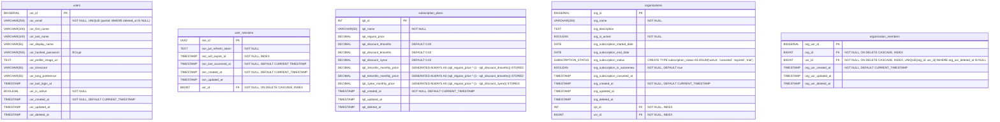

```mermaid
erDiagram
    users {
        BIGSERIAL usr_id PK
        VARCHAR(255) usr_email "NOT NULL, UNIQUE (partial: WHERE deleted_at IS NULL)"
        VARCHAR(100) usr_first_name
        VARCHAR(100) usr_last_name
        VARCHAR(55) usr_display_name
        VARCHAR(255) usr_hashed_password "BCrypt"
        TEXT usr_profile_image_url
        VARCHAR(55) usr_timezone
        VARCHAR(55) usr_lang_preference
        TIMESTAMP usr_last_login_at
        BOOLEAN usr_is_active "NOT NULL"

        TIMESTAMP usr_created_at "NOT NULL, DEFAULT CURRENT_TIMESTAMP"
        TIMESTAMP usr_updated_at
        TIMESTAMP usr_deleted_at
    }
    
    user_sessions {
        UUID ssn_id PK
        TEXT ssn_jwt_refresh_token "NOT NULL"
        TIMESTAMP ssn_will_expire_at "NOT NULL, INDEX"
        TIMESTAMP ssn_last_accessed_at "NOT NULL, DEFAULT CURRENT TIMESTAMP"

        TIMESTAMP ssn_created_at "NOT NULL, DEFAULT CURRENT_TIMESTAMP"
        TIMESTAMP ssn_updated_at

        BIGINT usr_id FK "NOT NULL, ON DELETE CASCADE, INDEX"
    }
    
    subscription_plans {
        INT spl_id PK
        VARCHAR(55) spl_name "NOT NULL"
        DECIMAL spl_regular_price
        DECIMAL spl_discount_3months "DEFAULT 0.00"
        DECIMAL spl_discount_6months "DEFAULT 0.00"
        DECIMAL spl_discount_1year "DEFAULT 0.00"
        DECIMAL spl_3months_monthly_price "GENERATED ALWAYS AS (spl_regular_price * (1 - spl_discount_3months)) STORED"
        DECIMAL spl_6months_monthly_price "GENERATED ALWAYS AS (spl_regular_price * (1 - spl_discount_6months)) STORED"
        DECIMAL spl_1year_monthly_price "GENERATED ALWAYS AS (spl_regular_price * (1 - spl_discount_1year)) STORED"

        TIMESTAMP spl_created_at "NOT NULL, DEFAULT CURRENT_TIMESTAMP"
        TIMESTAMP spl_updated_at
        TIMESTAMP spl_deleted_at
    }

    organizations {
        BIGSERIAL org_id PK
        VARCHAR(255) org_name "NOT NULL"
        TEXT org_description
        BOOLEAN org_is_active "NOT NULL"
        DATE org_subscription_started_date
        DATE org_subscription_end_date
        SUBSCRIPTION_STATUS org_subscription_status "CREATE TYPE subscription_status AS ENUM('active', 'canceled', 'expired', 'trial')"
        BOOLEAN org_subscription_is_autorenew "NOT NULL, DEFAULT true"
        TIMESTAMP org_subscription_canceled_at

        TIMESTAMP org_created_at "NOT NULL, DEFAULT CURRENT_TIMESTAMP"
        TIMESTAMP org_updated_at
        TIMESTAMP org_deleted_at

        INT spl_id FK "NOT NULL, INDEX"
        BIGINT usr_id FK "NOT NULL, INDEX"
    }

    organization_members {
        BIGSERIAL org_usr_id PK
        BIGINT org_id FK "NOT NULL, ON DELETE CASCADE, INDEX"
        BIGINT usr_id FK "NOT NULL, ON DELETE CASCADE, INDEX, UNIQUE(org_id, usr_id) WHERE org_usr_deleted_at IS NULL"

        TIMESTAMP org_usr_created_at "NOT NULL, DEFAULT CURRENT_TIMESTAMP"
        TIMESTAMP org_usr_updated_at
        TIMESTAMP org_usr_deleted_at
    }
    

```